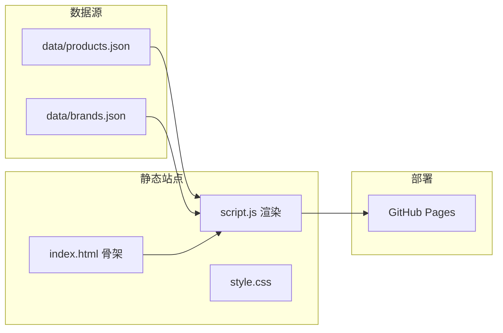

# 露营产品数据存储方案（静态站 + 频繁更新）

## 结论：需要「数据层」，但不必先上传统数据库服务器

你当前站点是 [index.html](index.html) 里硬编码约 12 款帐篷/天幕，[script.js](script.js) 只负责筛选与导航。产品数据在 HTML 里重复出现 3 次（总表、优缺点表、详情卡片），**频繁改价/加型号会非常痛苦且易不一致**。

结合你的选择（**更新频繁** + **坚持静态部署**），推荐：

| 阶段 | 方案 | 适合场景 |
|------|------|----------|
| **现阶段（推荐）** | `data/*.json` 作为唯一数据源 + JS 动态渲染 | 静态托管、无服务器、多人用 Git 维护 |
| **可选增强** | Google Sheets / Airtable → GitHub Action 自动生成 JSON | 非技术人员也要经常改数据 |
| **以后再考虑** | Supabase（PostgreSQL）+ 只读 API，前端仍静态 | 产品上百、要后台搜索/筛选/权限 |

**不建议**现在就自建 MySQL + 自建 API 服务器：与「静态部署」冲突，运维成本高，对当前 12 款产品规模过重。



---

## 数据模型设计

采用「品牌 + 产品 + 规格」三层，便于按品牌筛选、扩展品类。

**`data/brands.json`** — 品牌主数据

```json
[
  {
    "id": "mobi-garden",
    "name": "牧高笛",
    "nameEn": "Mobi Garden",
    "country": "CN",
    "tier": "T1"
  }
]
```

**`data/products.json`** — 产品主数据（每条一款型号）

```json
[
  {
    "id": "mobi-cold-mountain-2",
    "brandId": "mobi-garden",
    "category": "tent",
    "model": "冷山 2",
    "modelEn": "Cold Mountain 2",
    "structure": "穹顶双层",
    "weightKg": 2.3,
    "capacity": "2",
    "fabric": "210T 涤纶 · PU2000–3000",
    "priceMin": 400,
    "priceMax": 600,
    "priceCurrency": "CNY",
    "scenes": ["徒步入门", "周末露营"],
    "pros": "综合防护力强，支架稳固…",
    "cons": "2.3 kg 对长途背负略重",
    "imageUrl": "https://upload.wikimedia.org/...",
    "imageAlt": "穹顶双层帐篷实景",
    "updatedAt": "2026-05-17"
  }
]
```

字段说明：

- `category`: `tent` | `tarp`（对应现有筛选）
- 对比表列：从 `weightKg`、`capacity`、`fabric`、`priceMin/Max`、`scenes` 自动生成
- `pros` / `cons`：仅部分产品有值时，优缺点表可只渲染有数据的行
- `brandId` 外键关联品牌，避免品牌名拼写不一致

可选：天幕专用字段 `size`、`tarpType` 放在同一对象里，用 `category === "tarp"` 时展示不同列（或 `specs: { ... }` 扩展字段）。

---

## 前端改造（保持静态）

### 1. 精简 [index.html](index.html)

- 保留：顶栏、页面标题、筛选按钮、空容器（如 `#compare-tables`、`#product-detail`）
- 删除：所有重复的 `<table>` 行与 `<article class="product-card">` 硬编码块（约 400+ 行）

### 2. 扩展 [script.js](script.js)

- `fetch("data/products.json")` + `fetch("data/brands.json")`（部署时与 HTML 同域，GitHub Pages 可用）
- 函数：`renderCompareTable(category)`、`renderProsConsTable()`、`renderProductCards(category)`
- 现有 `data-compare-group` 筛选逻辑改为对渲染后的容器生效，或筛选时只重绘对应区块
- 加载失败时显示友好提示

### 3. [style.css](style.css)

- 基本无需大改；可为「加载中」增加 `.loading` 样式

### 4. 从现有 HTML 迁移数据

- 一次性脚本或手工：把当前 7 帐篷 + 5 天幕 + 4 条优缺点对比写入 `data/products.json` / `data/brands.json`
- 校验：品牌 `id` 唯一、产品 `id` 唯一、`brandId` 必须存在

---

## 日常更新流程（频繁维护）

**方案 A（立即可用）**：直接编辑 JSON → Git commit → 推送 → GitHub Pages 自动更新  
- 优点：零成本、有版本历史、多人 PR 审核  
- 缺点：需要会 JSON 语法（可用 VS Code 校验 schema）

**方案 B（可选，适合非开发同事）**：维护 Google 表格 → GitHub Action 定时/手动同步为 `data/products.json`  
- 表格列与 JSON 字段一一对应  
- 推送后站点自动更新，仍无需数据库服务器

---

## 何时再升级为「真数据库」（Supabase 等）

仅在以下情况再考虑：

- 产品量 > 100 且需要复杂筛选（多条件、排序、全文搜索）
- 需要后台管理界面 + 登录权限
- 需要用户提交评测、价格爬虫等写入场景

升级时：**保留 JSON 结构作为 schema 参考**，表结构对齐 `brands` + `products`，前端把 `fetch(json)` 换成 `fetch(supabase REST)`，静态部署方式不变。

---

## 实施步骤（建议顺序）

1. 新增 `data/brands.json`、`data/products.json`，从 [index.html](index.html) 迁移现有 12 款产品
2. 新增 JSON Schema（`data/products.schema.json`）便于编辑时校验
3. 重写 [script.js](script.js)：加载数据 → 渲染三张表 + 两组卡片
4. 精简 [index.html](index.html) 为骨架页
5. 本地用简单 HTTP 服务测试（`python -m http.server`，避免 `file://` 下 fetch 失败）
6. （可选）文档 `data/README.md` 说明字段含义与更新规范

---

## 风险与注意点

- **GitHub Pages + fetch**：必须通过 HTTP 访问，不能直接双击打开 HTML；部署后无此问题
- **图片**：继续用 Wikimedia URL 存在 JSON 的 `imageUrl`；大量自有图时可改放 `assets/` 相对路径
- **价格时效**：用 `updatedAt` 字段标注，页脚保留「仅供参考」说明
