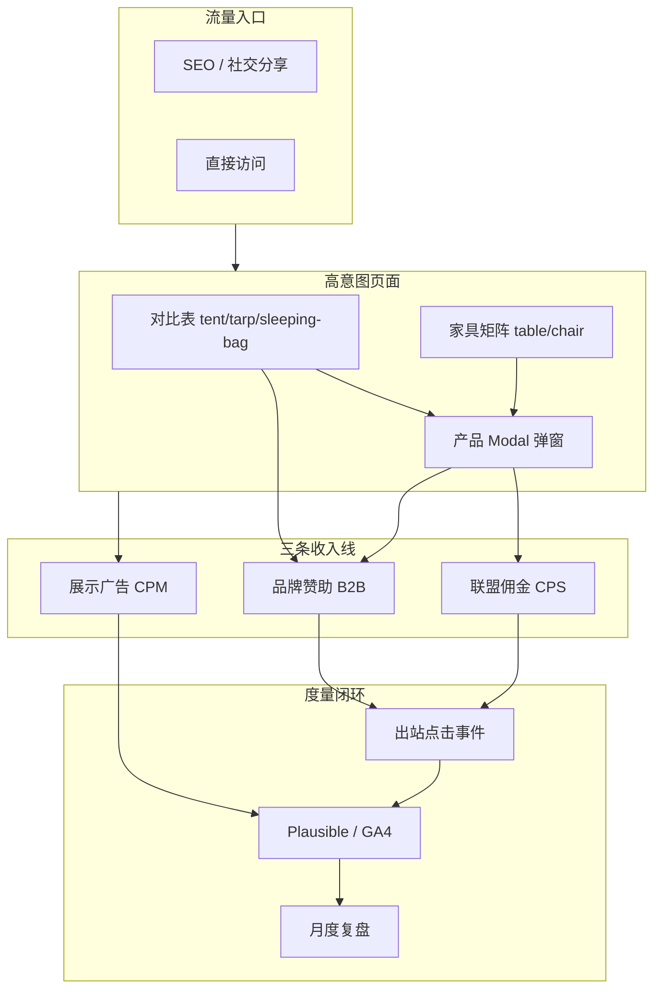
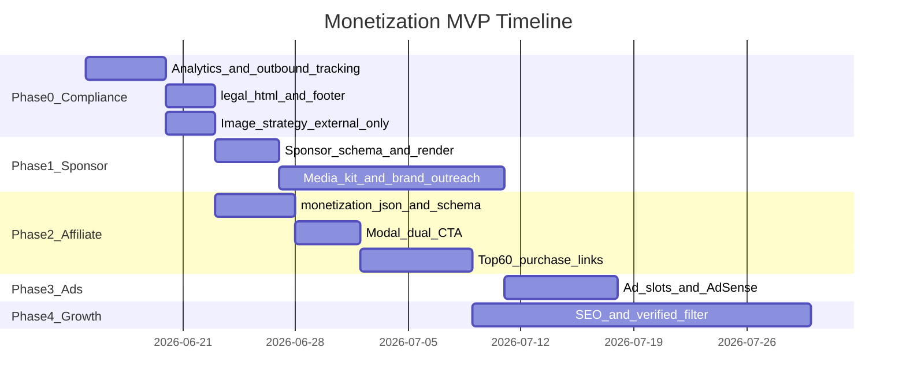
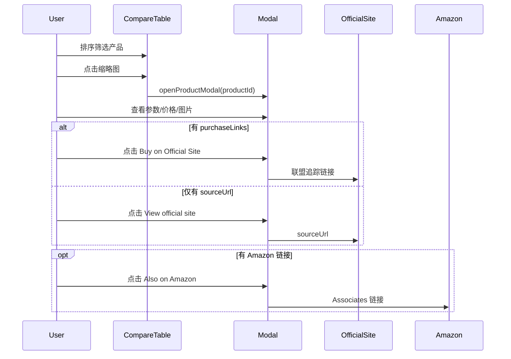

# CampGear Compare 盈利变现规划

> **版本**：2026-06-12  
> **适用站点**：[CampGear Compare](../index.html) — 静态露营装备对比站（GitHub Pages）  
> **目标市场**：海外（英文界面，`lang="en"`）  
> **变现模式**：品牌赞助 + 联盟佣金 + 展示广告  
> **执行说明**：本文档为单一参考源；按文末 Checklist 逐项推进。

---

## 1. 文档说明

CampGear Compare 将各品牌官网分散的产品参数整理为可排序对比表，帮助用户在买前快速横向比较。本文档定义三条收入线的逻辑、优先级、技术改动、合规要求与分阶段实施路线。

**核心原则**：

- 变现不能伤害对比表的客观性与 UX
- 合规（FTC 披露、图片版权、隐私）先于收第一笔钱
- 数据规模（554 款 × 11 品牌）是谈判赞助的筹码，不是联盟 CTR 的前提

**与旧计划的关系**：`.cursor/plans/网站盈利变现规划_71038347.plan.md` 基于 2 品牌 / 中文 / 产品卡模式，已过时。执行以本文档为准。

---

## 2. 现状快照

基于当前代码库（2026-06-12）：

| 维度 | 数据 |
|------|------|
| 产品总量 | **554 款**，11 品牌 official 数据 |
| 品类分布 | tent 242 / sleeping-bag 162 / tarp 58 / table 45 / chair 47 |
| 已接入品牌 | big-agnes, blackdeer, dod, helinox, mobi-garden, montbell, nanga, naturehike, nemo, sea-to-summit, snow-peak |
| 品牌列表 | 17 品牌在 `data/brands.json`（含 Coleman、MSR、Hilleberg 等待抓取） |
| 页面交互 | 对比表 + **产品 Modal 弹窗**（tent / tarp / sleeping-bag / furniture） |
| 出站链接 | Modal 底部 `View official site ↗` → `product.sourceUrl` |
| 技术栈 | HTML + CSS + vanilla JS（`script.js` IIFE），无构建工具 |
| 部署 | GitHub Pages，根目录即站点根 |

**当前缺口**（全库检索 affiliate / analytics / ads / monetization：**无匹配**）：

- 无联盟链接、无购买 CTA、无佣金追踪
- 无 Plausible / GA4 等分析工具
- 无广告位、无 `legal.html`
- 无 `data/monetization.json`、`purchaseLinks`、`sponsor` 字段

**合规冲突**：

- `tent.html` 等页脚仍声明：*"This site is a non-commercial spec comparison tool..."*
- `data/README.md` 标注「个人/非商用参数对比」
- 与商业化定位直接冲突，必须在 Phase 0 调整

**变现优势**：

用户处于**买前决策**阶段——在对比表筛选后点击缩略图打开 Modal 查看详情，这是**最高意图**的转化节点，比列表页外链价值高得多。

---

## 3. 变现架构



### 收入优先级

| 阶段 | 模式 | 理由 |
|------|------|------|
| **P0 短期（0–3 月）** | 品牌赞助 | 554 款 × 11 品牌已是媒体资产；B2B 单笔 $200–500/月 比早期联盟 CTR 更现实 |
| **P1 中期（1–6 月）** | 联盟佣金 | Modal 购买 CTA + Amazon/品牌 affiliate，随 SEO 流量放大 |
| **P2 长期（PV 1 万+/月）** | 展示广告 | AdSense 冷启动 → 流量达标后 Mediavine |

**建议节奏**：Phase 0 合规 → 并行 Phase 1 赞助 + Phase 2 联盟 → Phase 3 广告 → Phase 4 增长飞轮。

---

## 4. 三条收入线详解

### 4.1 品牌赞助（P0 — 首笔现金）

**卖点**：覆盖 11 品牌的垂直比价数据库；品牌可买「被看见」，而非修改对比参数。

| 赞助位 | 位置 | 形式 | 参考定价 |
|--------|------|------|----------|
| 品类置顶行 | 帐篷/睡袋/天幕对比表首行 | 行首 Badge「Sponsored」 | $300–500/月/品类 |
| Modal Featured | 打开弹窗前或弹窗内推荐 1 款 | 「Editor's Pick · Sponsored」 | $150–300/月 |
| 品牌专区 | 首页或品类页品牌 Banner | Logo + 跳转官网 | $500–800/月 |
| 数据合作包 | 品类洞察报告 | PDF + 站内曝光 | $1000+/次 |

**数据字段**（产品级，扩展 `data/products.schema.json`）：

```json
"sponsor": {
  "active": true,
  "tier": "table-featured",
  "label": "Sponsored",
  "expiresAt": "2026-09-01",
  "campaignId": "naturehike-q3-tent"
}
```

**编辑防火墙**（保公信力）：

- 赞助只影响**展示位置**，不改 `weightKg`、`priceMin` 等客观字段
- 必须标注 Sponsored（FTC 合规）
- 赞助产品仍需 `status: verified`
- `expiresAt` 到期后自动降级（`script.js` 渲染时过滤）
- 赞助签约时**顺带谈图片素材书面授权**（解决版权风险）

**首批 outreach 对象**（已有数据、易谈）：

Naturehike、Snow Peak、Helinox、Big Agnes、Sea to Summit

**售卖材料**：Phase 0 埋点导出「品类页月 PV + Modal 打开率 + 出站 CTR」制作 one-pager 媒体 kit。

---

### 4.2 联盟佣金（P1 — 规模化被动收入）

**最佳触点**：产品 Modal 底部，将「View official site」升级为双 CTA：

```
[ Buy on Official Site ]   ← 主按钮（品牌 affiliate 或 sourceUrl + 追踪）
[ Also on Amazon ↗ ]       ← 次链接（Amazon Associates）
```

对比表可增加「Buy」列，但 **Modal 是主战场**——用户已点开详情，转化意图最强。

**联盟渠道矩阵**：

| 渠道 | 适用品牌/产品 | 佣金参考 | 接入方式 |
|------|---------------|----------|----------|
| **Amazon Associates** | Coleman、Big Agnes、NEMO、MSR 等同款 | 4–8% | ASIN 映射 + `tag=AssociateID` |
| **品牌 Shopify Affiliate** | Naturehike、Snow Peak | 5–15% | 查 Impact / Shopify Collabs / ShareASale |
| **REI / Backcountry** | 高端帐篷睡袋 | 5–8% | 单独申请 |
| **AvantLink / CJ** | Montbell、Sea to Summit 等 | 视计划 | 按品牌查 |

**数据层扩展**：

产品 JSON 新增 `purchaseLinks`：

```json
"purchaseLinks": [
  {
    "platform": "official",
    "label": "Buy on Official Site",
    "url": "https://www.naturehike.com/products/...",
    "affiliate": true,
    "priority": 1
  },
  {
    "platform": "amazon",
    "label": "Amazon",
    "url": "https://www.amazon.com/dp/B0XXXXXX?tag=campgear-20",
    "asin": "B0XXXXXX",
    "affiliate": true,
    "priority": 2
  }
]
```

站点级配置 `data/monetization.json`：

```json
{
  "amazonAssociateTag": "campgear-20",
  "defaultRel": "noopener noreferrer sponsored",
  "disclosureShort": "Some links on this site are affiliate links. We may earn a commission at no extra cost to you. This does not affect our comparison objectivity."
}
```

**落地节奏**：

1. **MVP**：每品类 Top 15 热销款手工填链接（tent / tarp / sleeping-bag 各 15，约 45–60 款）
2. **扩展**：按 `brandId` 批量查 affiliate 计划；脚本辅助 ASIN 映射（需人工确认）
3. **回退**：无联盟链接时仍显示现有 `sourceUrl`「View official site」
4. **维护**：季度检查链接 404 / 价格变动

**UX 原则**：

- 主 CTA 用品牌色实心按钮；次 CTA 用文字链
- 链接统一：`rel="sponsored noopener noreferrer"` + `class="purchase-link"` + `data-product-id`
- Modal 底部短披露：读取 `monetization.json` 的 `disclosureShort`

---

### 4.3 展示广告（P2 — 流量达标后）

**广告位设计**（不破坏对比 UX）：

| 位置 | 页面 | 说明 |
|------|------|------|
| 对比表下方 | tent / tarp / sleeping-bag | 用户读完表后曝光，**首选** |
| 家具矩阵之间 | furniture.html | 桌子/椅子区块之间 |
| 页脚上方 | 全站 | 低干扰横条 |
| Modal 关闭后 | 可选 | 需 A/B 测是否伤体验 |

**禁止**：对比表内部、表头、排序列之间插广告（严重伤害核心体验与 SEO）。

**平台选择**：

| 阶段 | 平台 | 门槛 | RPM 参考 |
|------|------|------|----------|
| 冷启动 | Google AdSense | 低 | $2–5 |
| 成长期 | Mediavine / Raptive | ~50k sessions/月 | $15–25 |

**加载策略**：

- 广告脚本**延迟加载**（`requestIdleCallback` 或 scroll 触发），避免拖慢 LCP
- 全页广告位 ≤ 3 个
- 欧盟访客：Cookie 同意条后再加载（与 Privacy Policy 联动）

---

## 5. 合规前置（Phase 0 — 必须先做）

在收第一笔钱之前，必须完成以下事项。

### 5.1 分析与出站追踪

- 在 `index.html` 及品类页统一引入 **Plausible**（推荐，隐私友好）或 GA4
- 在 `script.js` 增加出站点击委托，监听 `.purchase-link` / `.sponsor-link`：

```javascript
// 上报 { productId, platform: 'amazon'|'official', page, category }
```

**核心 KPI**：

- 品类页 PV / 跳出率
- Modal 打开率
- 对比表排序使用率
- **出站 CTR**（按 platform 拆分）
- 赞助位 CTR vs 自然位 CTR

### 5.2 法律与披露页

新建 `legal.html`（或拆分多页），包含：

- **Affiliate Disclosure**：部分链接含联盟追踪，不影响推荐客观性（FTC 要求）
- **Privacy Policy**：分析工具、广告 Cookie、第三方链接
- **Content & IP Policy**：图片/文案来源、侵权通知联系方式
- **Sponsor Policy**：赞助内容如何标注、编辑独立性

页脚增加链接：Affiliate Disclosure · Privacy · Sponsor Policy

### 5.3 页脚与 README 改版

- 移除 *"non-commercial spec comparison tool"* 声明
- 改为含联盟披露的简短说明 + 链到 `legal.html`
- 更新 `data/README.md`：图片/文案用途从「非商用」调整为「参数对比 + 联盟导流」，保留 `sourceUrl` 溯源

### 5.4 产品图片版权

**结论：有版权风险，商业化会显著抬高风险等级。**（非法律意见，正式商业化前建议咨询律师。）

| 行为 | 风险 |
|------|------|
| 抓取官网产品图 | 照片受著作权保护，抓取不自动获得使用权 |
| 本地存储 `download_images.py` → `assets/products/` | **复制 + 再传播**，风险高于外链 CDN |
| 热链 Shopify CDN `imageUrl` | 仍是展示他人作品；可能违反站点 ToS |
| 抓取英文 `description` | 文案受版权保护，长摘要风险高于参数表 |

**推荐策略**（按安全优先排序）：

| 策略 | 做法 | 适用阶段 |
|------|------|----------|
| A. 品牌书面授权 | 赞助/联盟合作时签署素材使用许可 | 赞助洽谈时必做 |
| B. 联盟官方素材 | Amazon PA-API / affiliate kit approved assets | 有 Amazon 链接的产品 |
| C. 仅外链 + 不本地化 | 限制 `download_images.py`；Modal 只用 `imageUrl`；加来源标注 | MVP 最快落地 |
| D. 缩略图 + 跳转官网 | 对比表 80–120px 缩略图，详情区限制尺寸 | 降低复制争议 |
| E. 自拍/商用图库 | 自有实拍或购买图库 | 长期最安全，成本高 |

**规划默认路径**：Phase 0 采用 **C + D**；Phase 1 赞助签约时推进 **A**；Amazon 有 ASIN 的产品逐步切 **B**。

**前端改动**：

- 图片下增加：`© [Brand] · Image from official site`，链向 `sourceUrl`
- `script.js` 优先 `imageUrl`；仅 `imageLicense: "brand-approved"` 时用 `imageLocal`
- 收到品牌 C&D 邮件：24h 内移除对应展示条目

### 5.5 sourceUrl 溯源说明

`sourceUrl` = 产品数据来自品牌官网的详情页 URL。溯源 = 标明出处、让用户能点回官网核对。

**溯源 ≠ 授权**。注明出处是诚信做法，但不等于获得图片/文案使用许可。

---

## 6. 技术改动清单

| 文件 | 改动 |
|------|------|
| `data/products.schema.json` | 新增 `purchaseLinks`、`sponsor`、`imageLicense` |
| `data/monetization.json` | **新建**，联盟 ID、披露文案 |
| `script.js` | `resolvePurchaseLinks()`、Modal 双 CTA、赞助置顶、出站追踪、披露条 |
| `style.css` | `.purchase-cta`、`.sponsor-badge`、`.ad-slot`、`.affiliate-disclosure` |
| `tent.html` / `tarp.html` / `sleeping-bag.html` / `furniture.html` / `index.html` | 广告位容器、页脚法律链接、分析脚本 |
| `legal.html` | **新建** |
| `scripts/validate_official.py` | 校验 `purchaseLinks` URL 格式、`sponsor.expiresAt` |
| `data/README.md` | 商业化合规说明 |

### Modal 改造起点

当前 `script.js` 中 Modal 出站逻辑（约第 817–827 行）：

```javascript
var linkEl = document.getElementById("product-modal-link");
var sourceWrap = document.getElementById("product-modal-source");
if (linkEl && sourceWrap) {
  if (product.sourceUrl) {
    linkEl.href = product.sourceUrl;
    linkEl.removeAttribute("hidden");
    sourceWrap.hidden = false;
  }
}
```

改造方向：

1. 新增 `resolvePurchaseLinks(product)` → 按 `priority` 返回链接数组
2. 将 `#product-modal-source` 从单链接扩展为 CTA 按钮组
3. 无 `purchaseLinks` 时回退到 `sourceUrl`
4. 绑定 click 事件上报 analytics

### 赞助置顶逻辑

`renderCategoryPage()` 渲染对比表前：

1. 过滤 `sponsor.active === true` 且 `expiresAt` 未过期的产品
2. 置顶到表格首行（可多条，按 `campaignId` 排序）
3. 行首渲染 `<span class="sponsor-badge">Sponsored</span>`
4. 参数列仍显示真实数据，不参与虚假排序

---

## 7. 实施路线图



### 分周交付物

| 周次 | 交付物 | 预期收入 |
|------|--------|----------|
| 第 1 周 | Plausible/GA4 + 出站事件 + `legal.html` + 页脚改版 | $0 |
| 第 2–3 周 | Modal 双 CTA + Top 60 联盟链接 | $0–50/月 |
| 第 4–6 周 | 赞助位上线 + 向 3–5 品牌 pitch | $200–500/月（首单） |
| 第 2–3 月 | SEO 优化 + 扩 ASIN 映射 + AdSense | $50–150/月 |
| 第 6 月+ | 流量 8k+ PV，赞助 2–3 客户 | $500–1500/月 |

---

## 8. 收入预估

假设 **6 个月后月 PV 8,000**（554 款长尾 SEO 比早期 201 款更有潜力）：

| 来源 | 计算 | 月收入 |
|------|------|--------|
| 赞助 | 2 个品类置顶 × $350 | **$700** |
| 联盟 | 8000 × 5% 进 Modal × 8% 点购买 × 3% 转化 × $100 × 6% 佣金 | **~$72** |
| 广告 | 8000 × $4 RPM / 1000 | **~$32** |
| **合计** | | **~$800/月** |

**结论**：

- **早期**：赞助 > 联盟 > 广告
- **中期**：联盟随 SEO 流量复利
- **长期**：日 PV 3–5 万后，广告 + 联盟形成可观被动收入

早期低 PV 时联盟收入极低（月 PV 5000、CTR 3% 时仅 ~$18/月），不应把联盟作为唯一期望。

---

## 9. 风险与对策

| 风险 | 说明 | 对策 |
|------|------|------|
| 抓取图片商用版权 | 本地托管 + 广告/赞助 = 最高风险 | 外链 + 缩略图；赞助拿书面授权；Amazon 用官方素材 |
| 品牌 DMCA / 律师函 | 554 款图片量大，易被注意到 | `legal.html` 留联系邮箱；24h 下架 SOP；优先谈联盟/赞助转授权 |
| 产品文案版权 | Modal 展示长段 `description` | 只保留参数 + 一句 highlights；长文案改为链出官网 |
| 联盟链接失效 | 产品下架、URL 变更 | 定期脚本检测 404 + `validate_official` 扩展 |
| 赞助损害公信力 | 用户怀疑对比不客观 | 强制 Sponsored Badge + 编辑政策页；客观参数不可付费修改 |
| 广告拖慢静态站 | LCP 恶化影响 SEO | 延迟加载 + 全页 ≤ 3 广告位 |
| Amazon 账号审核 | 新站可能被拒 | 先有内容再申请；被拒则用品牌站联盟兜底 |
| 页脚 non-commercial 冲突 | 法律表述与商业行为矛盾 | Phase 0 必须改版 |

---

## 10. 执行 Checklist

按 Phase 顺序推进，完成后将 `[ ]` 改为 `[x]`。

### Phase 0：合规与基础设施

- [x] 选定分析工具（Plausible 或 GA4），在全部 HTML 页引入脚本
- [x] `script.js` 添加出站 click 事件（`.purchase-link`、`.sponsor-link`、`#product-modal-link`）
- [x] 新建 `legal.html`（Affiliate Disclosure / Privacy / Content & IP / Sponsor Policy）
- [x] 全部页面页脚：移除 non-commercial 声明，添加 legal 链接 + 短披露
- [x] 更新 `data/README.md` 合规说明（非商用 → 对比 + 联盟导流）
- [x] 图片策略：确认仅外链 CDN，暂停无授权本地 `download_images.py` 批量下载
- [x] Modal / 对比表缩略图加来源标注（© Brand · Image from official site）
- [x] 跑通埋点：验证 Modal 打开、出站点击能在 dashboard 看到（本地见控制台 `[CampGear analytics]`；上线后配置 `data/analytics.json`）

### Phase 1：品牌赞助

- [x] `data/products.schema.json` 新增 `sponsor` 字段定义
- [x] `data/sponsors.json` + `script.js` 赞助置顶、`sponsor-badge` 渲染、`expiresAt` 过期过滤
- [x] `style.css` 添加 `.sponsor-badge`、`.compare-table__row--sponsored`、Modal 赞助条
- [ ] 制作媒体 kit one-pager（PV、Modal 率、出站 CTR、品牌覆盖数）
- [ ] 确定赞助定价表与合同模板（含素材授权条款）
- [ ] 向 Naturehike / Snow Peak / Helinox / Big Agnes / Sea to Summit 发送 outreach

### Phase 2：联盟佣金

- [ ] 申请 Amazon Associates（或备选联盟平台）
- [ ] 新建 `data/monetization.json`（Associate tag、披露文案）
- [ ] `data/products.schema.json` 新增 `purchaseLinks` 字段
- [ ] `script.js` 实现 `resolvePurchaseLinks()` + Modal 双 CTA UI
- [ ] `style.css` 添加 `.purchase-cta`、`.affiliate-disclosure`
- [ ] 为 tent / tarp / sleeping-bag 各 Top 15 产品手工填写 `purchaseLinks`（约 45–60 款）
- [ ] 对比表可选增加「Buy」列（有链接的产品才显示）
- [ ] `scripts/validate_official.py` 校验 purchaseLinks URL 格式

### Phase 3：展示广告

- [ ] 品类页 HTML 添加 `.ad-slot` 容器（对比表下方、页脚上方）
- [ ] `style.css` 广告位样式 + 延迟加载占位
- [ ] 申请 Google AdSense
- [ ] 欧盟 Cookie 同意条（若启用 AdSense）

### Phase 4：增长飞轮

- [ ] 各品类页优化 `<title>` / `<meta description>`（含型号关键词）
- [ ] `script.js` 仅展示 `status: verified` 产品（或分级展示）
- [ ] 对比表 URL 参数分享（如 `?sort=weight`）
- [ ] 扩展 ASIN 映射脚本（`scripts/map_amazon_asin.py` 或等价工具）
- [ ] 抓取并接入 Coleman / MSR / Hilleberg 等高客单价品牌数据

---

## 附录 A：关键文件路径

| 用途 | 路径 |
|------|------|
| 首页 | `index.html` |
| 品类页 | `tent.html`, `tarp.html`, `sleeping-bag.html`, `furniture.html` |
| 渲染逻辑 | `script.js` |
| 样式 | `style.css` |
| 品牌列表 | `data/brands.json` |
| 产品库 | `data/official/{brandId}/products.json` |
| 产品索引 | `data/official/index.json` |
| 数据说明 | `data/README.md` |
| 抓取配置 | `scripts/scrape/config.yaml` |
| 本文档 | `docs/monetization-plan.md` |

## 附录 B：Modal 用户流（变现触点）



---

*文档结束。执行过程中如有策略调整，请直接更新本文档并注明修订日期。*
